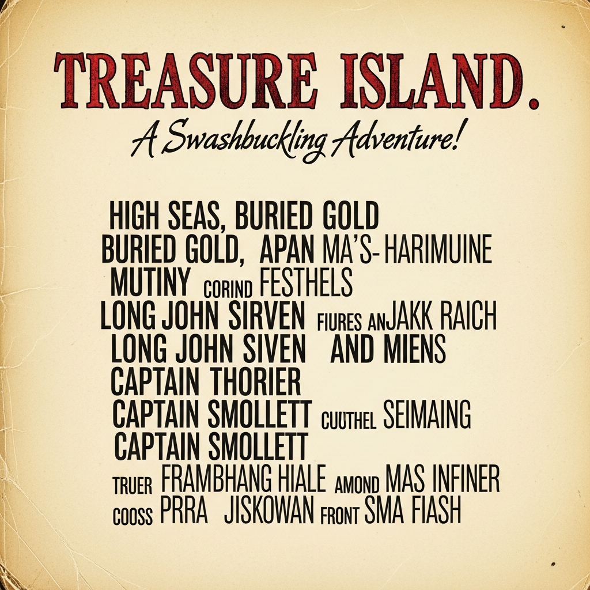

# 🏴‍☠️ [스토리보드] 해적 영화 멀티모달 광고 기획서

## 1. 브랜드 아이덴티티 및 캠페인 정의
*   **브랜드(영화명):** 가상 영화 《블랙 오션: 잃어버린 나침반 (Black Ocean)》
*   **타겟:** 판타지/액션 영화를 좋아하고, 인스타그램/틱톡 AR 필터 놀이를 즐기는 1030 세대
*   **톤앤매너:** 어둡고 웅장한 시네마틱(Cinematic), 신비로운 황금빛, 트렌디한 숏폼 감성
*   **캠페인 목표:** 영화 개봉 알림 및 한정판 굿즈 판매, AR 필터를 통한 자발적 바이럴 유도
*   **핵심 메시지:** "바다의 지배자가 되어, 당신만의 보물을 쟁취하라!"

---

## 2. 씬(Scene)별 스토리보드 구성 (총 10초)

### 🎬 씬 1: 영화 트레일러 (Intro)
*   **씬 번호 / 길이:** Scene 1 / 3초
*   **목표 메시지:** 거대한 스케일의 해적 영화가 개봉함을 강렬하게 알림
*   **화면 구성:** [구도] 로우 앵글(아래에서 위로) / [피사체] 거대한 해적선 / [배경] 폭풍우 치는 밤바다와 번개 / [텍스트] 없음
*   **내레이션(카피):** (웅장한 천둥소리) "전설이 깨어난다."
*   **사용 도구 및 목적:**
    *   비디오: **VEO 3.1** (텍스트 기반으로 압도적이고 사실적인 파도 물리효과와 카메라 무빙 생성)
    *   오디오: Suno (웅장한 오케스트라 배경음악)
*   **입력 프롬프트:** `Cinematic tracking shot moving forward, an epic pirate ship crashing through massive stormy waves at night, dramatic lightning strikes illuminating the dark clouds, photorealistic water physics, 8k resolution.`
*   **출력 결과 요약:** 카메라가 전진하며 번개 치는 폭풍우 속 해적선을 사실적으로 담아낸 영상
*   **결과 파일명:** `scene01_ship_veo.mp4`

### 💎 씬 2: 굿즈 홍보
*   **씬 번호 / 길이:** Scene 2 / 2초
*   **목표 메시지:** 영화 속 핵심 아이템(나침반)을 매력적인 실물 굿즈로 어필
*   **화면 구성:** [구도] 클로즈업 접사 / [피사체] 황금 나침반 / [배경] 낡은 보물지도 / [텍스트] 없음
*   **내레이션(카피):** "잃어버린 나침반을 손에 넣을 기회."
*   **사용 도구 및 목적:**
    *   비디오: **VEO 3.1** (제품의 질감을 살리고, 빛이 반사되는 미세한 턴테이블 모션 생성)
*   **입력 프롬프트:** `Macro close-up shot, camera slowly panning around a beautifully crafted golden pirate compass resting on an old wooden map, the compass needle spinning, glowing magical light reflecting on the gold, soft cinematic lighting.`
*   **출력 결과 요약:** 나침반 바늘이 돌아가며 황금빛이 고급스럽게 반사되는 클로즈업 영상
*   **결과 파일명:** `scene02_compass_veo.mp4`

### 🛒 씬 3: 온라인 구매 유도
*   **씬 번호 / 길이:** Scene 3 / 2초
*   **목표 메시지:** 해당 굿즈를 지금 바로 온라인에서 살 수 있음을 직관적으로 전달
*   **화면 구성:** [구도] 정면 / [피사체] 스마트폰 화면 속 나침반 굿즈 / [배경] 어두운 스튜디오 조명 / [텍스트] 'BUY NOW' 버튼
*   **내레이션(카피):** "지금 바로 샵에서 만나보세요."
*   **사용 도구 및 목적:**
    *   비디오: **VEO 3.1** (스마트폰 화면이 켜지며 쇼핑몰 UI가 나타나는 모션 생성)
*   **입력 프롬프트:** `A modern smartphone held in a hand, screen turns on revealing an online shopping page with a golden pirate compass and a glowing 'BUY NOW' button, dark cinematic background, shallow depth of field.`
*   **출력 결과 요약:** 스마트폰 화면에 굿즈 쇼핑몰 창과 구매 버튼이 선명하게 나타나는 영상
*   **결과 파일명:** `scene03_shop_veo.mp4`

### 🤳 씬 4: AR 필터 체험 및 CTA (마지막 3~5초 필수 조건)
*   **씬 번호 / 길이:** Scene 4 / 3초
*   **목표 메시지:** 시청자가 직접 참여할 수 있는 AR 필터 안내 및 최종 브랜드 각인
*   **화면 구성:** [구도] 셀카 구도 / [피사체] 평범한 사람에서 해적으로 변하는 인물 / [배경] 네온 빛이 도는 방 / [텍스트] 영화 로고 및 검색창 UI
*   **내레이션(카피):** "당신도 해적이 되어보라. [블랙 오션] 절찬 상영중!"
*   **사용 도구 및 목적:**
    *   비디오: **VEO 3.1** (인물의 얼굴이 해적으로 자연스럽게 모핑(Morphing)되는 AR 효과 연출)
    *   오디오: ElevenLabs (자연스럽고 카리스마 있는 성우 내레이션)
*   **입력 프롬프트:** `Selfie camera angle, a young person looking at the camera, a digital AR filter suddenly applies transforming them into a fierce pirate captain with a tricorn hat and a scar, dynamic neon lighting, smooth transition.`
*   **출력 결과 요약:** 셀카를 찍는 인물이 해적 선장으로 부드럽게 변신하는 AR 필터 체험 영상
*   **결과 파일명:** `scene04_ar_filter_veo.mp4`

---

## 3. 💡 [필수] 프롬프트 수정 전/후 기록 (씬 1 적용)

*   **수정 전 의도:** 폭풍우 속의 해적선을 웅장하게 표현하고 싶음.
*   **수정 전 프롬프트:** `A pirate ship in a storm at night, video`
*   **문제점 (VEO 3.1 특성 반영):** 카메라가 고정되어 있어 영상이 밋밋하고, 파도의 움직임이 부자연스러워 영화 예고편 같은 시네마틱한 느낌이 부족함.
*   **수정 후 변경:** `Cinematic tracking shot moving forward, an epic pirate ship crashing through massive stormy waves at night, dramatic lightning strikes illuminating the dark clouds, photorealistic water physics, 8k resolution.`
*   **수정 이유 및 결과:** VEO 3.1이 카메라의 움직임을 이해할 수 있도록 `Cinematic tracking shot moving forward`(앞으로 전진하는 시네마틱 트래킹 샷)을 추가하고, `photorealistic water physics`(실사 같은 물 물리효과)를 명시함. 그 결과, 카메라가 배를 향해 다가가며 파도가 부서지는 역동적이고 완성도 높은 영상이 생성됨.

---
