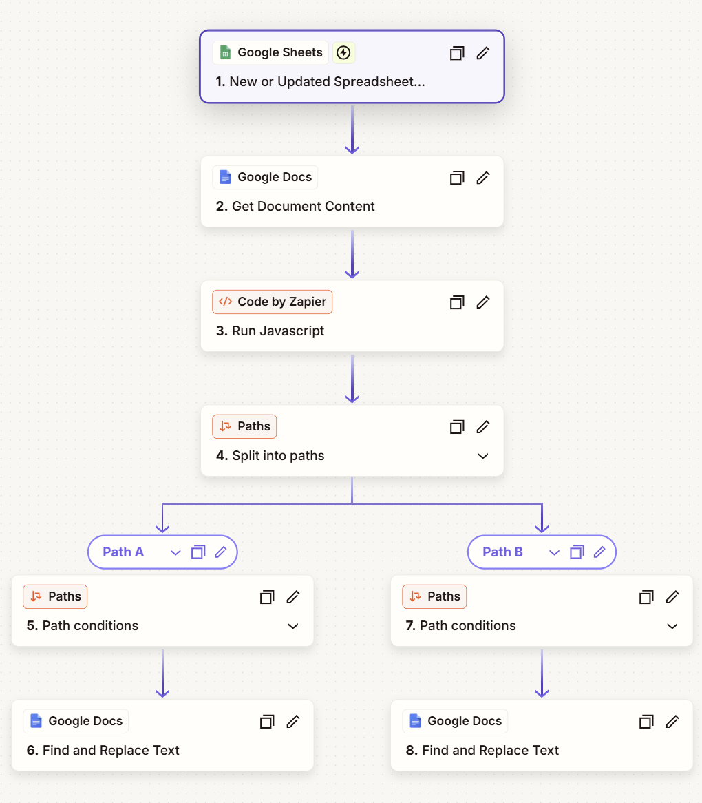
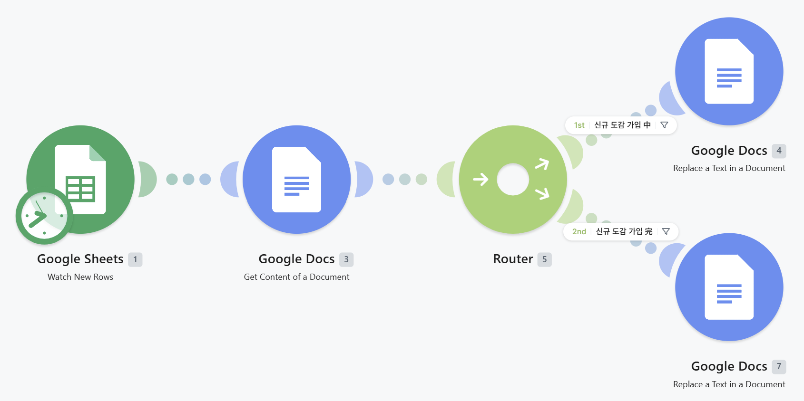
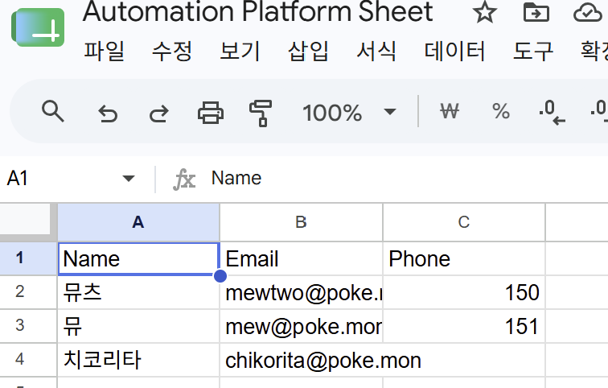
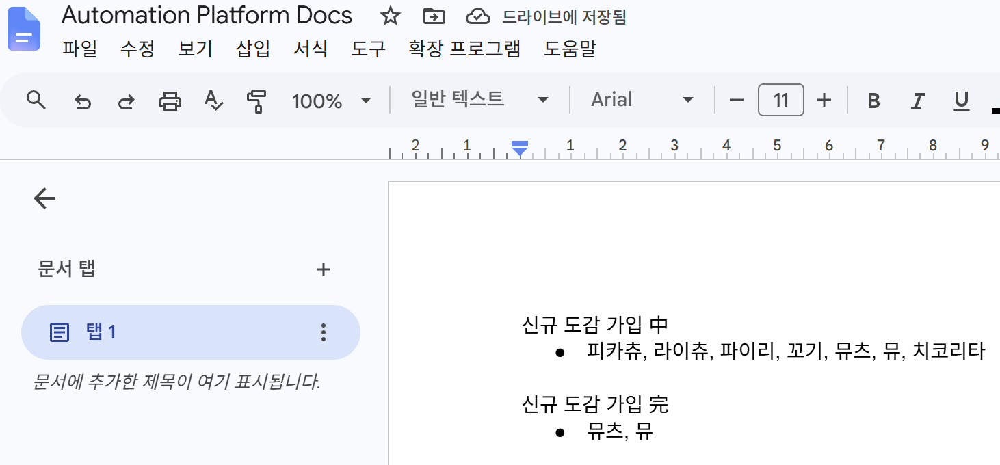
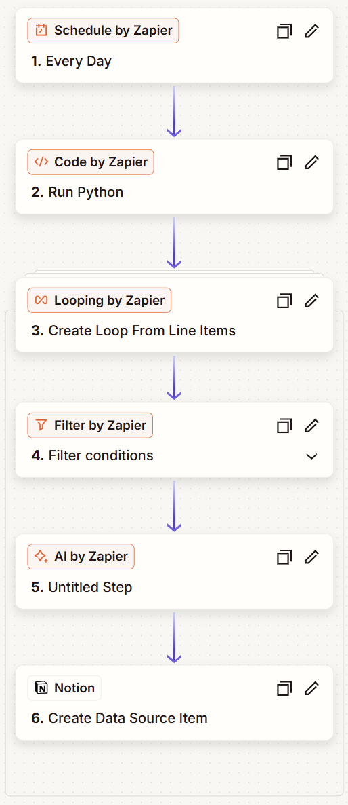
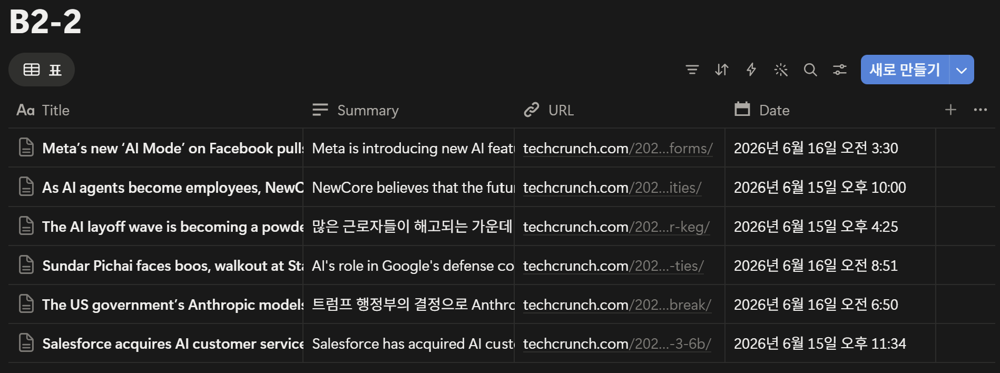

## 자동화 도구 비교 구현 (Zapier vs Make)

**컨텐츠:** 포켓몬을 잡아 시트에 기록하면 도감인 Docs에 자동 기록  
**워크플로우:** Google Sheets "Name" 컬럼 변경 → 조건 분기(행 작성 기준) → Google Docs 기록

---

### [Zapier 구현]

### [Make 구현]

### [실행 결과]

---

### [비교 분석 보고서]

| 항목 | Zapier | Make |
|------|--------|------|
| **사용 편의성** | ⭐ 매우 쉬움 단계별 선형적 구조 | 🔧 다소 어려움 시각적·자유로운 연결 방식 |
| **가격 정책** | Task 기반 액션 성공 시 1 Task 차감 | Credit 기반 모듈 실행 시 1 Credit 차감 (AI·코드는 추가 소비) |
| **연동 앱 수** | 8,000개 이상 업계 최고 수준 | 3,000개 이상 주요 앱 대부분 지원 |
| **무료 플랜** | 100 Tasks/월 2단계 Zap 제한 (트리거 1 + 액션 1) | 1,000 Credits/월 |
| **추천 대상** | 초보자 · 비개발자 - 다양한 앱 연동이 필요한 경우 - 빠르고 간단한 자동화를 원하는 경우 | 중급 이상 · 개발자 - 비용 효율이 중요한 경우 - 복잡한 로직의 자동화가 필요한 경우 |

---
---

## 자유 주제 자동화 설계 및 구현

**주제:** 뉴스 요약 자동화 워크플로우  
**선정 이유:** Zapier의 AI Builder인 Copilot 덕분에 빠르고 쉽게 구현 가능

---

### [워크플로우 설계 문서]

| 단계 | 도구 | 설명 |
|------|------|------|
| 1️⃣ **트리거** | Schedule by Zapier | 매일 오전 9:00 (KST) 자동 실행 |
| 2️⃣ **데이터 수집** | RSS by Zapier | [TechCrunch AI](https://techcrunch.com/category/artificial-intelligence/feed/) 피드에서 최신 기사 최대 10개 수집 |
| 3️⃣ **반복 처리** | Looping by Zapier | 수집된 각 기사마다 아래 단계 반복 실행 |
| 4️⃣ **필터링** | Filter by Zapier | "AI" 키워드가 포함된 기사만 통과 |
| 5️⃣ **요약 생성** | OpenAI (GPT-4o mini) | 기사 내용을 한국어 3줄 요약으로 변환 |
| 6️⃣ **저장** | Notion | 데이터베이스에 저장 (제목 / URL / 요약 / 발행일) |

---

### [Zapier 구현]

### [실행 결과]

